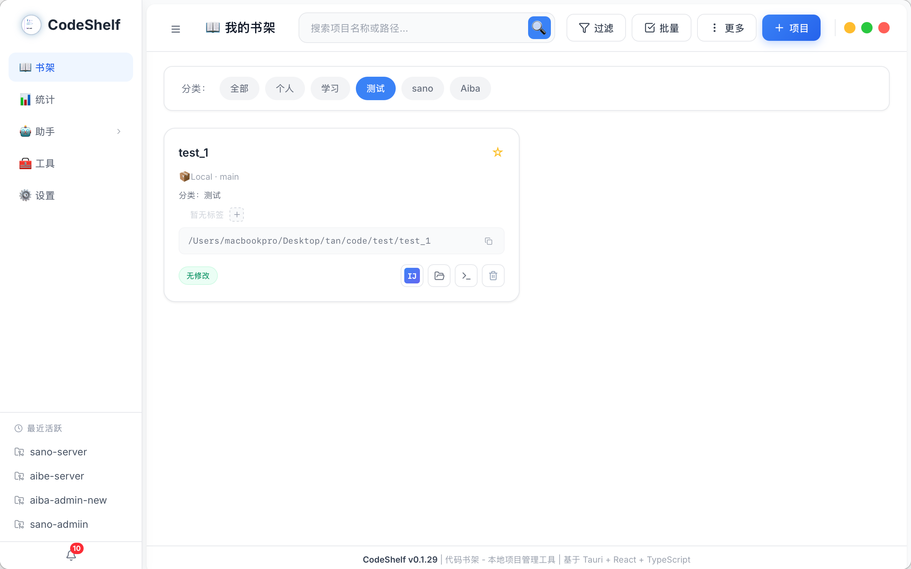
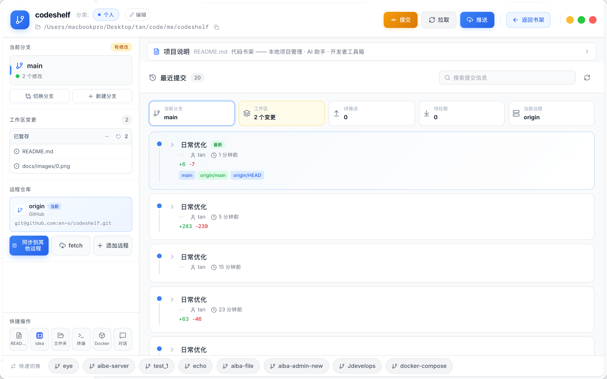
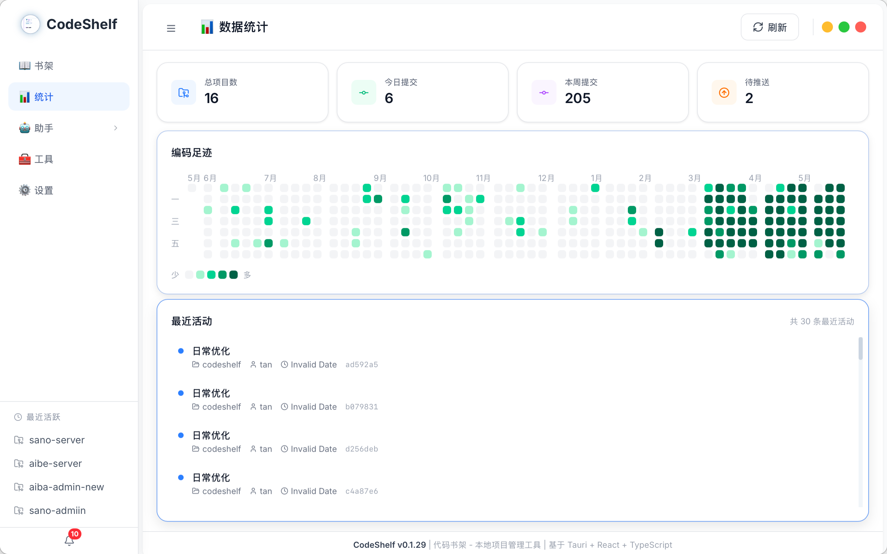
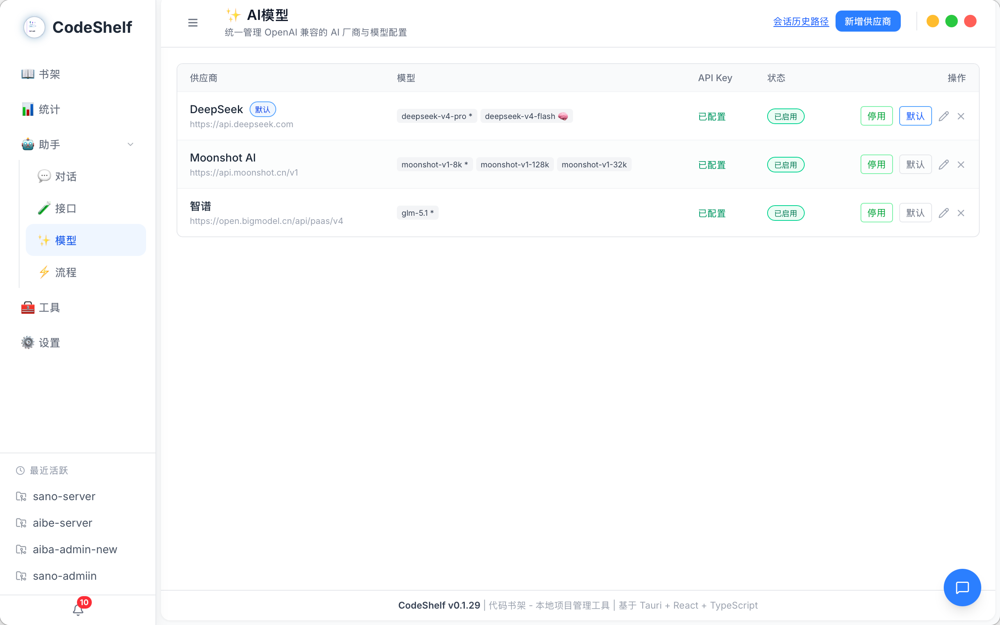
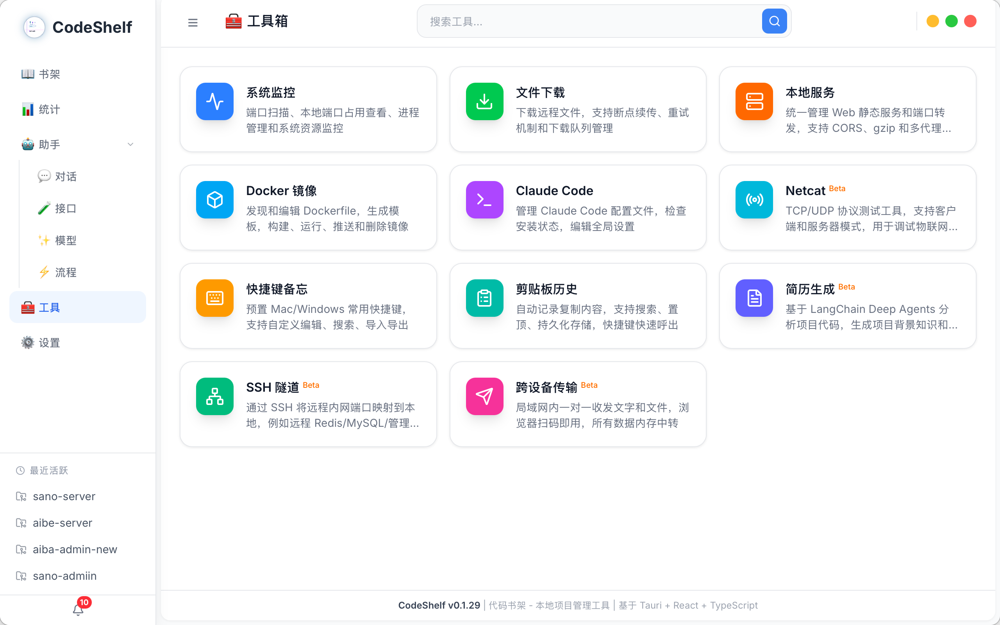
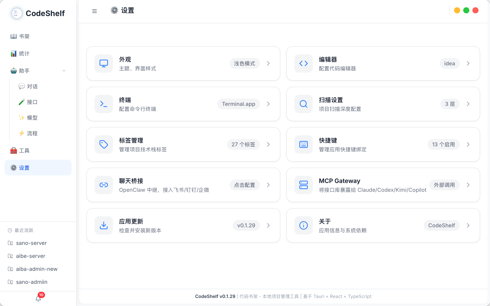

# CodeShelf

> 代码书架 —— 本地项目管理 · AI 助手 · 开发者工具箱

随着参与的项目越来越多，本地仓库分散在不同目录、不同托管平台（GitHub / Gitee / GitLab），常常出现：找不到项目在哪、忘了哪些还没提交或推送、在文件管理器 / 终端 / 编辑器之间反复切换。

CodeShelf 把这些都收进一个桌面应用：集中管理本地 Git 项目，直观查看自己的编码活动，并顺手内置了一批日常会用到的 AI 助手与开发工具。

## 📦 下载安装

前往 [Releases 页面](https://github.com/en-o/codeshelf/releases) 下载适用于 **Windows / macOS / Linux** 的最新安装包，或 Windows 免安装的便携版。

## ✨ 功能一览

### 📖 书架
集中管理本地 Git 项目：扫描目录批量入库、卡片 / 列表视图、搜索与收藏，点开即可查看项目详情与 Git 状态。

### 📊 统计
开发活动看板：项目总数、今日 / 本周提交、待推送数量，以及一整年的提交热力图，让贡献情况一目了然。

### 🤖 助手
内置 AI 能力，分为四个子页：

| 子页 | 说明 |
|------|------|
| 💬 对话 | 多会话 AI 对话，可调用工具、可授权操作本地目录 |
| 🧪 接口 | 管理接口库（分组 / 接口 / 鉴权），让 AI 调用你自己的接口 |
| ✨ 模型 | 管理 OpenAI 兼容的供应商与模型，内置验证聊天 |
| ⚡ 流程 | 定时编排「抓取网页 → 大模型 → Webhook」的自动化流程 |

### 🧰 工具
开箱即用的开发者工具箱：

| 工具 | 说明 |
|------|------|
| 系统监控 | 端口扫描、本地端口占用查看、进程管理和系统资源监控 |
| 文件下载 | 下载远程文件，支持断点续传、重试机制和下载队列管理 |
| 本地服务 | 统一管理 Web 静态服务和端口转发，支持 CORS、gzip 和多代理规则 |
| Docker 镜像 | 发现和编辑 Dockerfile，生成模板，构建、运行、推送和删除镜像 |
| Claude Code | 管理 Claude Code 配置文件，检查安装状态，编辑全局设置 |
| 快捷键备忘 | 预置 Mac/Windows 常用快捷键，支持自定义编辑、搜索、导入导出 |
| 剪贴板历史 | 自动记录复制内容，支持搜索、置顶、持久化存储，快捷键快速呼出 |
| Netcat `beta` | TCP/UDP 协议测试工具，支持客户端和服务器模式，用于调试物联网设备 |
| 简历生成 `beta` | 基于 LangChain Deep Agents 分析项目代码，生成项目背景知识和 STAR 简历经历 |
| SSH 隧道 `beta` | 通过 SSH 将远程内网端口映射到本地，例如远程 Redis/MySQL/管理面板 |
| 跨设备传输 `beta` | 局域网内一对一收发文字和文件，浏览器扫码即用，所有数据内存中转 |

### ⚙️ 设置
主题切换、编辑器配置、目录扫描深度，以及 AI 供应商与会话存储路径等偏好设置。

## 🧑‍💻 开发

本项目基于 **Tauri + React + TypeScript** 构建。环境要求、本地运行、构建打包与发版流程详见 **[开发与构建指南](BUILD.md)**。

更多文档：
- [开发文档](docs/DEVELOPMENT.md) - 项目结构与模块说明
- [API 文档](docs/API.md) - 接口文档
- [Tauri 命令开发指南](docs/TAURI-COMMANDS.md) - 前后端通信
- [MCP Gateway](docs/MCP-GATEWAY.md) - 将接口库暴露给 Claude Code、Kimi、Codex、Copilot 等 MCP 客户端

## 📄 许可证

[Apache License 2.0](LICENSE)

## 🙏 致谢

- [Tauri](https://tauri.app/) - 跨平台桌面应用框架
- [React](https://react.dev/) - UI 框架
- [TailwindCSS](https://tailwindcss.com/) - CSS 框架
- [Lucide](https://lucide.dev/) - 图标库
