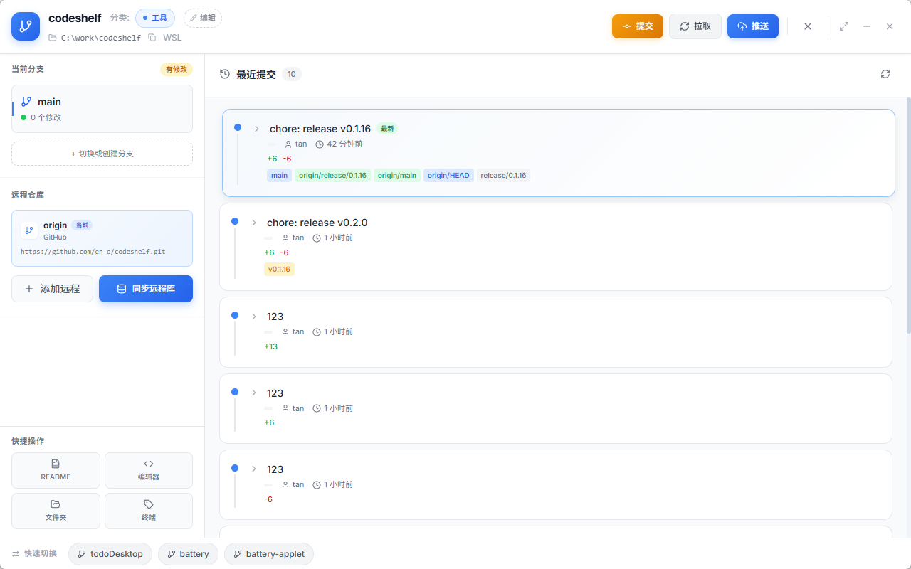
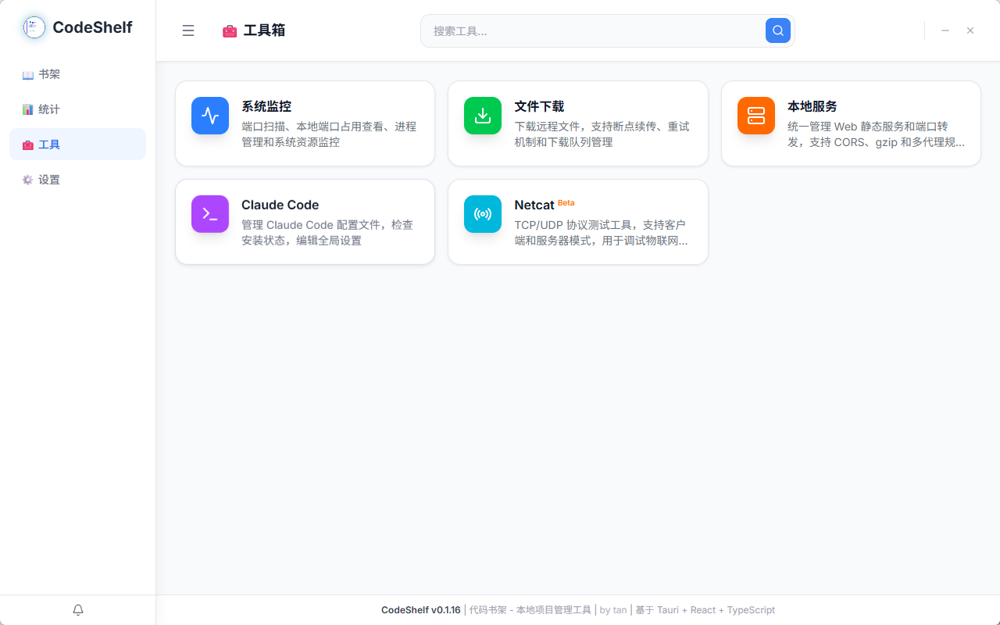

# CodeShelf

代码书架 - 本地项目管理工具

随着开发者参与的项目日益增多，本地存储着大量的代码仓库。这些项目分散在不同目录，使用不同的远程托管平台（GitHub、Gitee、GitLab），管理和维护变得愈发困难。开发者常常面临以下困境：

- 找不到某个项目在哪里
- 忘记哪些项目有未提交或未推送的代码
- 需要频繁在文件管理器、终端、编辑器之间切换
- 难以直观了解自己的编码活动和贡献情况






## 安装
前往 [Releases 页面](https://github.com/en-o/codeshelf/releases) 下载适用于 Windows、macOS 或 Linux 的最新安装包或便携版。

## 🛠 技术栈

### 前端
- **框架**: React 19 + TypeScript
- **构建**: Vite
- **样式**: TailwindCSS v4
- **状态**: Zustand + TanStack Query
- **图标**: Lucide React

### 后端
- **框架**: Tauri 2.x
- **语言**: Rust
- **数据库**: SQLite (tauri-plugin-sql)

## 📋 环境要求

### 必需环境

| 环境 | 版本要求    | 安装方式 |
|------|---------|---------|
| Node.js | >= 20.x | [nodejs.org](https://nodejs.org/) |
| Rust | >= 1.77 | [rustup.rs](https://rustup.rs/) |
| Tauri CLI | >= 2.x  | `cargo install tauri-cli` |

### 系统依赖

#### Windows
无需额外安装，确保已安装 [WebView2](https://developer.microsoft.com/en-us/microsoft-edge/webview2/)（Windows 10/11 通常已预装）。

#### macOS
```bash
xcode-select --install
```

#### Linux (Ubuntu/Debian)
```bash
sudo apt update
sudo apt install -y \
  pkg-config \
  libgtk-3-dev \
  libwebkit2gtk-4.1-dev \
  libjavascriptcoregtk-4.1-dev \
  libsoup-3.0-dev \
  libappindicator3-dev \
  librsvg2-dev
```

## 🚀 快速开始

### 1. 克隆项目
```bash
git clone https://github.com/en-o/codeshelf.git
cd codeshelf
```

### 2. 安装依赖
```bash
# 安装前端依赖
npm install

# 安装 Tauri CLI（如果尚未安装）
cargo install tauri-cli
```

### 3. 开发模式运行
```bash
# 启动 Tauri 开发服务器
npm run tauri dev
```

开发服务器启动后：
- 前端服务：http://localhost:1420
- Tauri 应用会自动打开桌面窗口

## 📦 构建与打包

### 构建安装版
```bash
npm run tauri build
```

构建产物位置：
- **Windows**: `src-tauri/target/release/bundle/msi/` 和 `nsis/`
- **macOS**: `src-tauri/target/release/bundle/dmg/` 和 `macos/`
- **Linux**: `src-tauri/target/release/bundle/deb/` 和 `appimage/`

### 构建便携版（绿色版，仅 Windows）

便携版无需安装，解压即用，不支持自动更新。

```bash
# 方式 1：运行脚本
scripts\build-portable.bat

# 方式 2：npm 命令
npm run build:portable
```

构建完成后在项目根目录生成：
```
CodeShelf-Portable-vX.X.X-x64.zip
├── CodeShelf.exe    # 主程序
└── .portable        # 便携版标记（禁用自动更新）
```

### 发版流程

使用发版脚本自动更新版本号并触发 GitHub Actions 构建：

```bash
# Windows
scripts\release.bat 0.2.0

# Linux/macOS
./scripts/release.sh 0.2.0
```

发版脚本会：
1. 更新 `package.json`、`tauri.conf.json`、`Cargo.toml` 中的版本号
2. 创建 `release/x.x.x` 分支并推送
3. 触发 GitHub Actions 自动构建并发布

发布产物包括：
- 安装版（`.msi`、`.exe`、`.dmg`、`.deb`、`.AppImage`）
- 便携版（`CodeShelf-Portable-vX.X.X-x64.zip`）
- 自动更新文件（`latest.json`）

## ✨ 模型/供应商管理

用于管理 OpenAI 兼容的 AI 供应商与模型，并提供验证聊天能力。

- **供应商卡片**：展示 Base URL、模型数量、API Key 配置状态、默认模型。
- **状态徽章**：默认/启用状态以高对比徽标展示，便于快速识别。
- **新增/编辑抽屉**：在右侧抽屉完成新增与编辑，避免页面过长。
- **会话历史路径**：顶部入口调整存储路径并迁移历史（目标目录需为空）。
- **验证聊天**：右下角悬浮球打开验证聊天，支持多会话与流式输出。

相关页面：`src/pages/AiProviders/index.tsx`、`src/pages/Settings/AiProviderSettings.tsx`

                                                                                                                                                                                                                                                                                                                                                                                                                                                                                                                                                                                                                                                                                                                                                                                                                                                                                                                                                                                                                                                                                                                                                                                                                                                                                                                                                                                                                                                                                                                                                                                                                                                                                                                                                                                                                                                                                                                                                                                                                                                                                                                                                                                                                                                                                                                                                                                                                                                                                                                                                                                                                                                                                                                                                                                                                                                                                                                                                                                                                                                                                                                                                                                                                                                                                                                                                                                                                                                                                                                                                                                                                                                                                                                                                                                                                                                                                                                                                                                                                                                                                                                                                                                                                                                                                                                                                                                                                                                                                                                                                                                                                                                                                                                                                                                                                                                                                                                                                                                                                                                                                                                                                                                                                                                                                                                                                                                                                                                                                                                                                                                                                                                                                                                                                                                                                                                                                                                                                                                                                                                                                                                                                                                                                                                                                                                                                                                                                                                                                                                                                                                                                                                                                                                                                                                                                                                                                                                                                                                                                                                                                                                                                                                                                                                                                                                                                                                                                                                                                                                                                                                                                                                                                                                                                                                                                                                                                                                                                                                                                                                                                                                                                                                                                                                                                                                                                                                                                                                                                                                                                                                                                                                                                                                                                                                                                                                                                                                                                                                                                                                                                                                                                                                                                                                                                                                                                                                                                                                                                                                                                                                                                                                                                                                                                                                                                                                                                                                                                                                                                                                                                                                                                                                                                                                                                                                                                                                                                                                                                                                                                                                                                                                                                                                                                                                                                                                                                                                                                                                                                                                                                                                                                                                                                                                                                                                                                                                                                                                                                                                                                                                                                                                                                                                                                                                                                                                                                                                                                                                                                                                                                                                                                                                                                                                                                                                                                                                                                                                                                                                                                                                                                                                                                                                                                                                                                                                                                                                                                                                                                                                                                                                                                                                                                                                                                                                                                                                                                                                                                                                                                                                                                                                                                                                                                                                                                                                                                                                                                                                                                                                                                                                                                                                                                                                                                                                                                                                                                                                                                                                                                                                                                                                                                                                                                                                                                                                                                                                                                                                                                                                                                                                                                                                                                                                                                                                                                                                                                                                                                                                                                                                                                                                                                                                                                                                                                                                                                                                                                                                                                                                                                                                                                                                                                                                                                                                                                                                                                                                                                                                                                                                                                                                                                                                                                                                                                                                                                                                                                                                                                                                                                                                                                                                                                                                                                                                                                                                                                                                                                                                                                                                                                                                                                                                                                                                                                                                                                                                                                                                                                                                                                                                                                                                                                                                                                                                                                                                                                                                                                                                                                                                                                                                                                                                                                                                                                                                                                                                                                                                                                                                                                                                                                                                                                                                                                                                                                                                                                                                                                                                                                                                                                                                                                                                                                                                                                                                                                                                                                                                                                                                                                                                                                                                                                                                                                                                                                                                                                                                                                                                                                                                                                                                                                                                                                                                                                                                                                                                                                                                                                                                                                                                                                                                                                                                                                                                                                                                                                                                                                                                                                                                                                                                                                                                                                                                                                                                                                                                                                                                                                                                                                                                                                                  
```
codeshelf/
├── src/                          # 前端源代码
│   ├── components/               # React 组件
│   │   ├── layout/              # 布局组件（MainLayout, Sidebar）
│   │   ├── project/             # 项目组件（卡片、详情、扫描）
│   │   └── ui/                  # 基础 UI 组件（Button, Input, Heatmap）
│   ├── pages/                   # 页面组件
│   │   ├── Shelf/               # 项目书架页
│   │   ├── Dashboard/           # 数据统计页
│   │   └── Settings/            # 设置页
│   ├── services/                # API 服务层
│   │   ├── db/                  # 数据库操作
│   │   └── git/                 # Git 操作
│   ├── stores/                  # Zustand 状态管理
│   ├── types/                   # TypeScript 类型定义
│   └── styles/                  # 全局样式
├── src-tauri/                   # Tauri/Rust 后端
│   ├── src/                     # Rust 源代码
│   │   ├── commands/            # Tauri Commands
│   │   ├── db/                  # 数据库模块
│   │   └── git/                 # Git 操作模块
│   ├── capabilities/            # 权限配置
│   ├── Cargo.toml               # Rust 依赖
│   └── tauri.conf.json          # Tauri 配置
├── DEVELOPMENT.md               # 开发文档
├── API.md                       # API 文档
└── README.md                    # 项目说明
```

## 📚 文档

### 核心文档
- [开发文档](docs/DEVELOPMENT.md) - 详细的开发指南和项目结构说明
- [API 文档](docs/API.md) - 完整的 API 接口文档
- [Tauri 命令开发指南](docs/TAURI-COMMANDS.md) - 前后端通信开发指南

### 专题文档
- [图标管理](ICONS.md) - 图标文件说明和更新指南
- [图标配置](ICONS-SETUP.md) - 图标配置完整指南
- [自定义标题栏](docs/TITLEBAR.md) - 标题栏实现和扩展指南


## 🤝 贡献

欢迎提交 Issue 和 Pull Request！

1. Fork 本项目
2. 创建功能分支 (`git checkout -b feature/AmazingFeature`)
3. 提交更改 (`git commit -m 'Add some AmazingFeature'`)
4. 推送到分支 (`git push origin feature/AmazingFeature`)
5. 创建 Pull Request

## 📝 常用命令

| 命令 | 说明 |
|------|------|
| `npm run dev` | 启动前端开发服务器 |
| `npm run build` | 构建前端生产版本 |
| `npm run tauri dev` | 启动 Tauri 开发模式 |
| `npm run tauri build` | 构建桌面应用（安装版） |
| `npm run build:portable` | 构建便携版（绿色版） |
| `npm run tauri build -- --debug` | 构建调试版本 |

## 🐛 故障排除

### Tauri 构建失败
1. 确保系统依赖已安装
2. 清理缓存后重新构建：
   ```bash
   rm -rf node_modules src-tauri/target
   npm install
   npm run tauri build
   ```

### 前端热更新不工作
确保 Vite 开发服务器在 1420 端口运行，检查 `vite.config.ts` 配置。

### WebView 相关错误 (Linux)
确保安装了正确版本的 WebKitGTK：
```bash
pkg-config --modversion webkit2gtk-4.1
```

## 📄 许可证

[Apache License 2.0](LICENSE)

## 🙏 致谢

- [Tauri](https://tauri.app/) - 跨平台桌面应用框架
- [React](https://react.dev/) - UI 框架
- [TailwindCSS](https://tailwindcss.com/) - CSS 框架
- [Lucide](https://lucide.dev/) - 图标库


