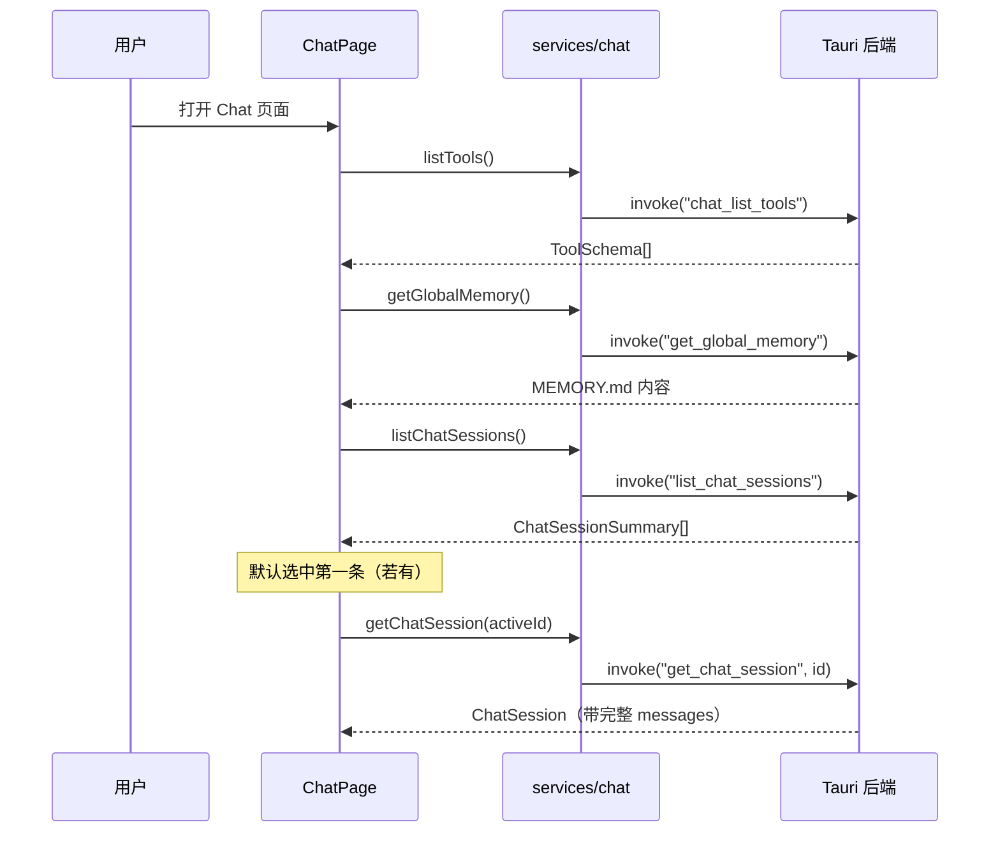
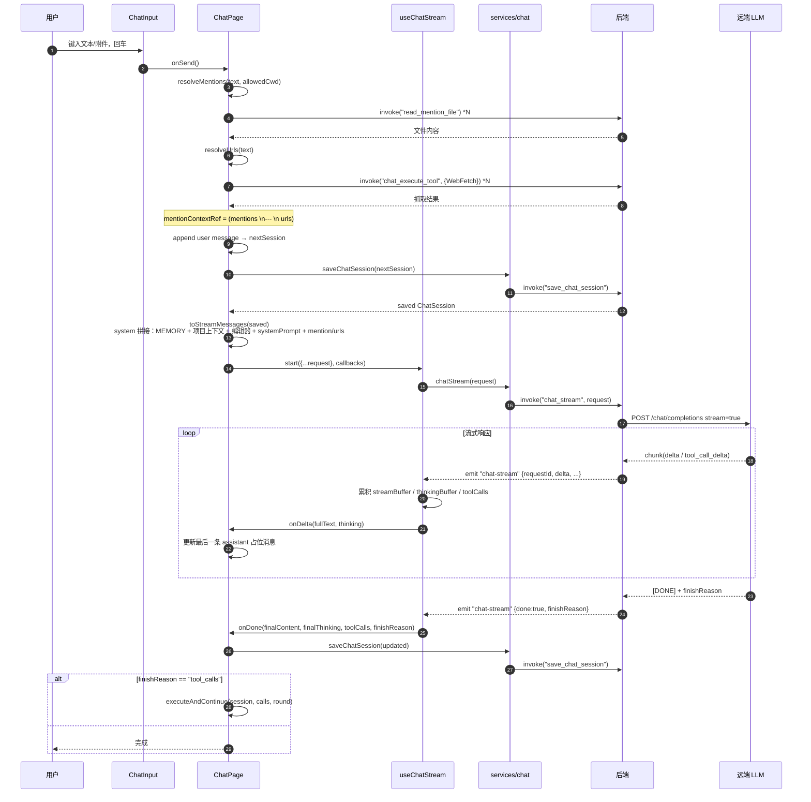
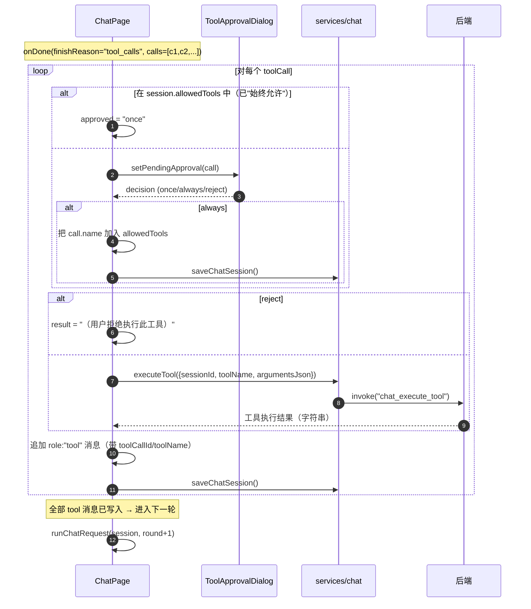
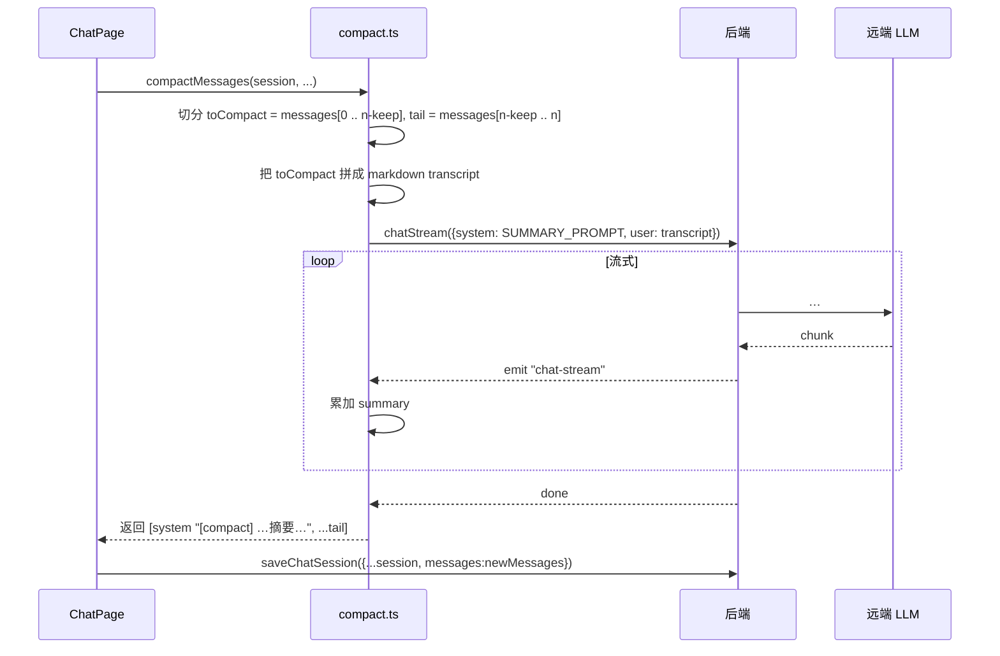
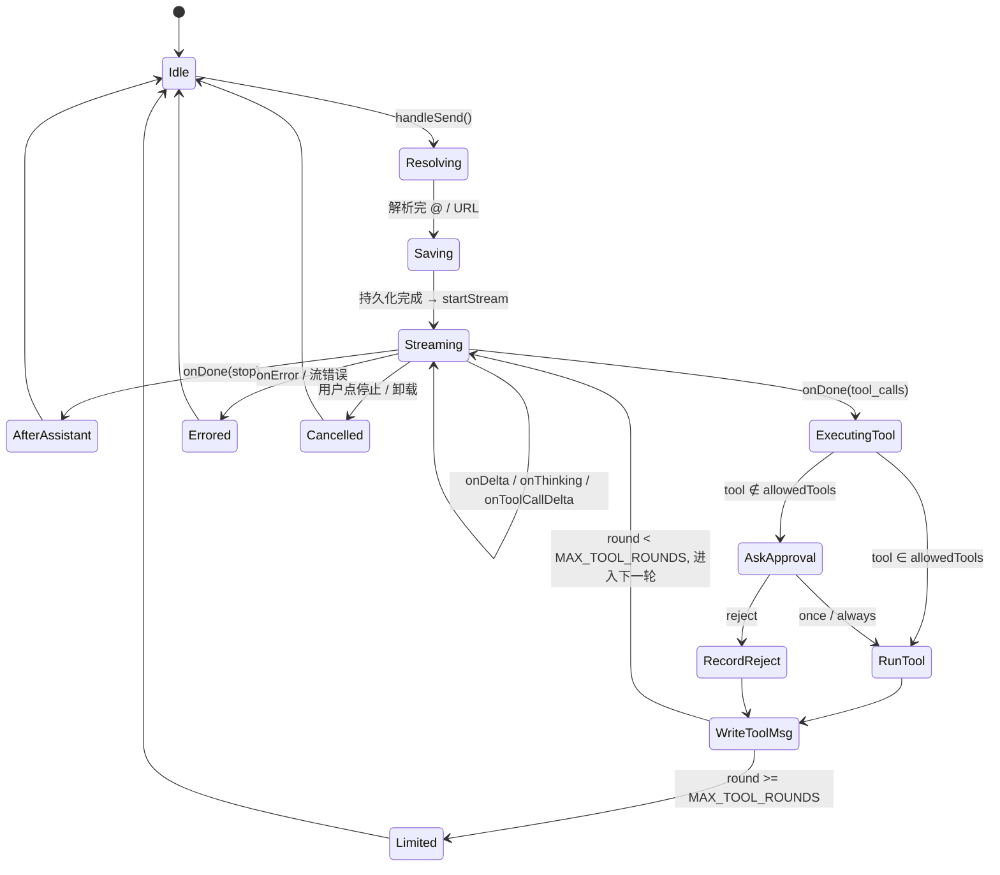

# Chat 对话功能设计文档

> 本文档描述 `src/pages/Chat` 模块的实现原理、数据流与关键交互流程。
> 与具体实现语言无关：前端为 TypeScript/React，后端为 Tauri Rust 命令；
> 文档中以"前端 / 后端 / 网络"作为抽象层来描述，方便其他语言/框架移植。

---

## 1. 模块定位与目标

Chat 模块是一个 **多会话、可流式、可工具调用** 的 LLM 对话面板。

核心能力：

1. **会话管理（Session）**：列表、创建、切换、重命名、删除、置顶、导入/导出（Markdown / JSON）。
2. **消息流式渲染（Streaming）**：通过事件总线把后端推送的增量 token 实时渲染到 UI。
3. **工具调用循环（Tool / Function Calling）**：支持 OpenAI 风格 `tools` + `tool_calls`，最多 10 轮自动循环；可"一次允许 / 始终允许 / 拒绝"。
4. **上下文增强**：
   - 全局记忆（`MEMORY.md`）
   - 项目上下文（目录树 + `CLAUDE.md` / `README.md`）
   - `@` 文件引用、URL 自动抓取（`WebFetch` 工具）
   - 多模态（图片附件 / 文本附件 / 拖放上传）
5. **采样参数 / 系统提示词**：每会话独立配置温度、max_tokens、top_p、frequency/presence penalty。
6. **运维类操作**：消息复制 / 编辑 / 重试 / 重新生成 / 删除、对话压缩 (`/compact`)、斜杠命令、Skills 模板。
7. **任务面板**：暴露 `TaskCreate / TaskUpdate / TaskList` 工具，让 LLM 可以维护当前会话的待办清单。

---

## 2. 总体架构

```
┌───────────────────────────────────────────────────────────────────┐
│                            前端（React）                            │
│                                                                   │
│  ┌─────────────────┐  ┌──────────────┐  ┌──────────────────────┐  │
│  │ SessionSidebar  │  │ MessageList  │  │ ChatInput            │  │
│  │ (会话列表)       │  │ (消息流)      │  │ (输入/斜杠/@提及/拖放)│  │
│  └────────┬────────┘  └──────┬───────┘  └──────────┬───────────┘  │
│           │                  │                     │              │
│           ▼                  ▼                     ▼              │
│  ┌──────────────────────────────────────────────────────────────┐ │
│  │                  ChatPage（容器组件）                          │ │
│  │  - state: sessions / activeSession / pendingApproval ...      │ │
│  │  - runChatRequest() : 发送一轮、接管流、处理工具循环           │ │
│  │  - executeAndContinue() : 执行 tool_calls，递归 runChatRequest │ │
│  │  - resolveMentions() / resolveUrls() / toStreamMessages()     │ │
│  └──────────────────────────────────────────────────────────────┘ │
│           │                                          ▲            │
│           ▼                                          │            │
│  ┌─────────────────────────┐         ┌──────────────────────────┐ │
│  │ useChatStream (hook)    │         │ services/chat (RPC 封装) │ │
│  │ - listen("chat-stream") │ ◄───────┤ chatStream / chatCancel  │ │
│  │ - 增量缓冲区              │  事件   │ saveChatSession 等       │ │
│  └────────────┬────────────┘         └────────────┬─────────────┘ │
└───────────────┼───────────────────────────────────┼───────────────┘
                │ event "chat-stream"               │ invoke()
                ▼                                   ▼
┌───────────────────────────────────────────────────────────────────┐
│                       后端（Tauri / Rust 命令）                     │
│  - chat_stream / chat_cancel                                      │
│  - chat_list_tools / chat_execute_tool                            │
│  - list/get/create/save/rename/delete_chat_session                │
│  - get/save_global_memory / list_skills / read_mention_file       │
└───────────────────────────────────────────────────────────────────┘
                │
                ▼ HTTPS（流式 SSE / chunked）
┌───────────────────────────────────────────────────────────────────┐
│                   远端 LLM（OpenAI 兼容协议）                        │
└───────────────────────────────────────────────────────────────────┘
```

**关键边界**：

| 边界            | 协议                                                    |
| --------------- | ------------------------------------------------------- |
| 前端 ↔ 后端     | Tauri `invoke()`（请求-响应） + `listen()`（事件单向流） |
| 后端 ↔ 远端 LLM | HTTPS，OpenAI Chat Completions `stream=true`            |
| 会话持久化      | 后端文件系统（每会话一个 JSON）                          |

---

## 3. 关键数据模型（语言无关）

### 3.1 ChatSession

```text
ChatSession {
  id                : string            // 会话唯一 ID
  title             : string            // 标题（首条用户消息自动摘要）
  providerId        : string            // AI 供应商 ID
  modelId           : string            // 模型 ID
  systemPrompt?     : string            // 自定义系统提示词
  temperature?      : number
  maxTokens?        : number
  topP?             : number
  frequencyPenalty? : number
  presencePenalty?  : number
  allowedCwd?       : string            // 允许工具读写的根目录
  allowedTools?     : string[]          // 已"始终允许"的工具名
  enabledTools?     : string[]          // 用户在 UI 勾选启用的工具子集
  pinned?           : boolean
  createdAt         : ISO-8601 string
  updatedAt         : ISO-8601 string
  messages          : ChatMessage[]
}
```

### 3.2 ChatMessage

```text
ChatMessage {
  id              : string
  role            : "system" | "user" | "assistant" | "tool"
  content         : string                 // 主体文本
  thinkingContent?: string                 // reasoning 模型的思考内容
  toolCalls?      : ToolCall[]             // assistant 角色：本轮工具调用
  toolCallId?     : string                 // tool 角色：对应 assistant 的 call.id
  toolName?       : string                 // tool 角色：工具名
  attachments?    : ChatAttachment[]       // user 角色：图片 / 文本附件
  edited?         : boolean
  createdAt       : ISO-8601 string
}

ToolCall { id, name, arguments(JSON 字符串) }
ChatAttachment = { kind:"image", dataUrl, name? } | { kind:"text", name, content }
```

### 3.3 ChatStreamMessage（发往 LLM 的 OpenAI 格式）

```text
ChatStreamMessage {
  role     : "system" | "user" | "assistant" | "tool"
  content  : string | Array<{ type:"text", text } | { type:"image_url", image_url:{url} }>
  toolCalls? : [{ id, type:"function", function:{ name, arguments } }]
  toolCallId?: string         // tool 角色
  name?      : string         // tool 角色：工具名
}
```

### 3.4 ChatStreamRequest

```text
ChatStreamRequest {
  requestId   : string         // 前端生成的 UUID，用于路由 chat-stream 事件
  providerId  : string
  model       : string         // 真实模型字符串，如 "gpt-4o-mini"
  baseUrl     : string
  apiKey?     : string
  thinking?   : boolean        // 是否开启 reasoning
  stream?     : boolean        // 默认 true
  messages    : ChatStreamMessage[]
  temperature?, maxTokens?, topP?, frequencyPenalty?, presencePenalty?
  tools?      : Array<{type:"function", function:{name, description, parameters}}>
  toolChoice? : "auto" | "none" | "required" | { type:"function", function:{name} }
}
```

### 3.5 StreamEvent（事件 `chat-stream` 的载荷）

```text
StreamEvent {
  requestId       : string                       // 必须匹配前端发起的 requestId
  delta?          : string                       // 主体内容增量（拼接后即完整正文）
  thinkingDelta?  : string                       // 思考内容增量
  toolCallDelta?  : { index, id?, name?, argumentsDelta? }
  finishReason?   : "stop" | "tool_calls" | ... // 仅最后一帧
  done            : boolean                      // 流是否结束
  error?          : string
}
```

### 3.6 ToolSchema

```text
ToolSchema {
  name        : string                  // 调用名，必须与 LLM 看到的一致
  description : string
  parameters  : JSONSchema
  requiresCwd : boolean                 // true 表示该工具需要会话已选择 allowedCwd
}
```

---

## 4. 目录结构与职责

```
src/pages/Chat/
├── index.tsx                  # 容器 ChatPage：状态/编排/请求生命周期
├── components/
│   ├── SessionSidebar.tsx     # 左侧会话列表
│   ├── SessionItem.tsx
│   ├── SessionConfigPanel.tsx # 系统提示 + 采样参数面板
│   ├── MessageList.tsx        # 消息流容器（自动滚动 + 思考中气泡）
│   ├── MessageItem.tsx        # 单条消息（含 toolCall / 编辑 / 重试 / 复制）
│   ├── MessageActions.tsx
│   ├── ChatInput.tsx          # 输入框（斜杠菜单/历史/@/拖放/粘贴图片）
│   ├── SlashCommandMenu.tsx
│   ├── AtMentionPicker.tsx    # @ 文件选择器（弹窗版）
│   ├── ToolCallBubble.tsx     # 工具调用气泡
│   ├── ToolApprovalDialog.tsx # 工具执行授权弹窗
│   ├── ToolPicker.tsx         # 工具选择器（直接调用工具）
│   ├── SkillsPicker.tsx       # Skills（提示词模板）选择器
│   ├── TaskPanel.tsx          # 任务/Todo 面板
│   └── RenameDialog.tsx
├── hooks/
│   └── useChatStream.ts       # 流式状态机 + 事件订阅
└── utils/
    ├── compact.ts             # /compact：调 LLM 把早期消息压成摘要
    ├── exportSession.ts       # 导出/导入 Markdown / JSON
    ├── slashCommands.ts       # 斜杠命令定义与匹配
    ├── groupSessions.ts       # 会话分组（置顶 / 今天 / 一周 / 更早）
    ├── time.ts
    └── tokens.ts              # 简易 char/4 估算
```

---

## 5. 启动与会话生命周期

### 5.1 ChatPage 挂载



### 5.2 切换会话

切换 `activeSessionId` → `useEffect` 重新拉取完整 `ChatSession`。
切换前若当前会话有变更，组件卸载/切换都会触发 `saveChatSession()` 兜底保存。

### 5.3 会话标题自动生成

- 首次发送后，若 `title === "新会话"` 或为空，且消息 ≥ 2，则取首条 user 消息前 20 字（截断加 `...`）作为标题。
- 重命名通过 `RenameDialog` → `renameChatSession()`。

---

## 6. 发送一条消息：完整时序

下图描述用户输入 `请帮我读取 README.md` 这种"普通对话 / 含 @ / 含 URL"的统一路径。



### 6.1 `toStreamMessages()`：发往 LLM 的消息构造

合并顺序（拼接为单条 system 消息，使用 `\n\n---\n\n` 分隔）：

1. **全局记忆 MEMORY.md**（若非空）
2. **项目上下文**：`allowedCwd` 路径 + 浅层文件树（最多 120 项） + `CLAUDE.md / AGENTS.md / README.md` 之一（截断 8000 字符）
3. **可用编辑器列表**：传给 LLM 的 `OpenInEditor` 工具用
4. **会话 systemPrompt**
5. **`mentionContextRef`**：本轮新解析的 `@文件` 与 `URL` 抓取结果

之后逐条历史消息：

- `assistant`：保留 `toolCalls`（转 `function` 类型）
- `tool`：保留 `toolCallId`、`name`、`content`
- `user`：
  - 含图片附件 + 当前模型支持视觉 → 拆分为 `[{type:"text"}, {type:"image_url"}]` 多模态分片
  - 仅文本附件 / 视觉模型未启用 → 文本附件以 ```` ``` ```` 拼到 content 前；图片降级为占位提示
- `system`：透传

### 6.2 工具开关与强制工具

- `toolsEnabled` 关闭时不传 `tools`，等同纯对话。
- 启用后：`tools = toolSchemas ∩ session.enabledTools`。
- **Soft-Force**（仅第 0 轮）：若最近一条 user 消息以 `[使用 NAME 工具]` 开头，自动设置：
  ```
  tools     = [仅 NAME]
  toolChoice= { type:"function", function:{ name:NAME } }
  ```
  目的：让用户能明确指定工具，避免模型自由发挥。

---

## 7. 流式事件机制（前端侧）

`useChatStream` 是一个有限状态机：

```text
        start()                       onDone / onError / stop()
idle ───────────► streaming ─────────────────────────► idle
   ▲                  │
   │   listen("chat-stream", filter by requestId)
   └──────────────────┘
```

**关键不变量**：

- 仅当 `payload.requestId === requestId` 时才处理事件 → 保证旧会话/旧请求的回包不会污染当前 UI。
- 三个累积缓冲区：
  - `streamBufferRef` — 主体文本（不可丢，断流后用作 `finalContent`）
  - `thinkingBufferRef` — reasoning 内容
  - `toolCallsRef` — `tool_calls` 按 `index` 槽位累积，`id/name` 来一次写一次，`argumentsDelta` 累加
- `done=true` 时：
  - 触发 `onDone(final*, finishReason)`
  - 清理 `requestId`、`streaming` 标志位
- 卸载/`stop()`：调 `chatCancel(requestId)` 通知后端中断 HTTP 请求，并清空缓冲。

---

## 8. 工具调用循环



**安全控制**：

- `MAX_TOOL_ROUNDS = 10`：超过则警告并停止，防止死循环。
- 工具执行作用域受 `session.allowedCwd` 限制（由后端校验，写/执行类工具的 `requiresCwd=true`）。
- 三档授权：
  - `once`：仅本次允许
  - `always`：写入 `session.allowedTools`，下次同名工具自动放行
  - `reject`：写入一条 `role:"tool"` 拒绝结果，让 LLM 看到并继续

---

## 9. 上下文增强细节

### 9.1 `@` 文件提及

输入框中以 `@` 触发：

- 触发条件：光标前缀匹配 `(?:^|[\s(（[{])@([^\s@]*)$`
- 候选列表来自 `listDirEntries(allowedCwd, 5000)`，内存中 fuzzy 包含匹配，按"目录优先 + 字典序"排序，前 80 条展示。
- 选中后插入文本：含空格/引号路径用 `@"..."` 引用形式（路径中的 `\ "` 转义）。

发送时 `resolveMentions()`：

- 正则匹配 `@"..."` 和 `@xxx`（兼容尾部标点）
- 逐路径调用 `read_mention_file(root, relPath)`：
  - 文件 → 拼成 `### path\n```\n…\n``` `
  - 目录 → 后端返回 `[引用目录] …` 文本，原样保留
- 整体作为 `[引用文件]` 段，注入到 system 头部。

### 9.2 URL 自动抓取

用户文本中匹配到的 `https?://` URL，前 5 个会通过 `WebFetch` 工具预抓取（max_bytes=400000），结果汇成 `[抓取的网页内容]` 段，与 `@` 段合并到 `mentionContextRef`。

### 9.3 全局记忆 MEMORY.md

- 加载：组件挂载时 `getGlobalMemory()`。
- 编辑：💭 记忆 按钮 → `memoryEditorOpen` 弹窗 → `saveGlobalMemory(content)`。
- 注入：每次 `toStreamMessages()` 都会作为 system 第 1 段，全局影响所有会话。

### 9.4 项目上下文

`useEffect` 监听 `activeSession.allowedCwd`：

1. `listDirEntries(cwd, 200)` 取浅层文件树（前 120 显示）
2. 依次尝试读 `CLAUDE.md → AGENTS.md → README.md → README`，第一个有内容者纳入（截断 8000 字符）
3. 结果存入 `projectContextRef`，下次发送即生效

---

## 10. 输入框关键交互

`ChatInput` 自带几条独立小状态机：

| 触发                                | 状态                                                     | 说明                                  |
| ----------------------------------- | -------------------------------------------------------- | ------------------------------------- |
| 文本以 `/` 开头且无换行             | `showSlashMenu`                                          | `↑↓` 选、`Enter` 应用、`Esc` 关闭     |
| 光标前缀匹配 `@xxx`                 | `showMentionMenu`                                        | 同上，`Tab` 也可应用                  |
| 输入框为空时按 `↑`                  | 进入历史回溯（`userHistory[0..n]`）                       | `↓` 退回更近，最终回到空              |
| 流式中按 `Esc`                      | 触发 `onStop()`                                          | 等价于点击"停止"按钮                  |
| 拖放文件/目录                       | 走 `webkitGetAsEntry` 递归（深度 ≤ 2，最多 20 个文件）   | 图片转 dataUrl；文本转字符串（≤5MB）  |
| 粘贴图片                            | 监听 `paste` 中 `kind=file & image/*`                    | 直接转 dataUrl 加入 `pendingAttachments` |

`Enter` 不带 Shift 即发送；输入法 `composing` 中不会被误触发。

---

## 11. 斜杠命令

| 命令                                | 行为                                                                 |
| ----------------------------------- | -------------------------------------------------------------------- |
| `/clear`                            | 清空当前会话 messages（保留会话）                                    |
| `/new`                              | 新建会话                                                             |
| `/export` / `/export-json`          | 导出当前会话到文件                                                   |
| `/import`                           | 从 JSON 文件导入                                                     |
| `/system`                           | 打开会话设置面板，焦点跳到 systemPrompt                              |
| `/config`                           | 打开会话设置面板，焦点跳到采样参数                                   |
| `/model`                            | 聚焦顶部模型下拉                                                     |
| `/regenerate` (`/regen`)            | 删除最后一条 assistant 消息后重发                                    |
| `/compact`                          | 压缩早期消息为摘要（见下节）                                         |
| `/skills`                           | 打开 Skills 选择器，选中后将模板渲染插入输入框                       |
| `/tool`                             | 打开 Tool 选择器，可执行或在输入框插入"使用 NAME 工具"前缀           |
| `/help`                             | Toast 列出所有命令                                                   |

发送时若整段文本恰好等于一个命令名（或别名），先执行命令再清空，不走 LLM。

---

## 12. /compact 对话压缩



`keep` 默认 4。摘要消息以 `role:"system"` 写回，标记 `[compact]`。

---

## 13. 持久化与目录结构

- **会话**：每会话一个 JSON，由后端管理（命令 `list_chat_sessions / get_chat_session / save_chat_session / rename_chat_session / delete_chat_session`）。
- **任务（Todo）**：每会话维护独立列表（`list_chat_tasks / create_chat_task / update_chat_task / delete_chat_task`）。LLM 可通过工具调用读写。
- **全局记忆**：单文件 `MEMORY.md`（`get_global_memory / save_global_memory`）。
- **Skills**：单文件目录（`list_skills / save_skill / delete_skill`）。
- **本地 UI 状态**：`localStorage`（如 `chat.sessionListCollapsed`）。

---

## 14. 错误处理与降级

| 场景                         | 处理                                                                            |
| ---------------------------- | ------------------------------------------------------------------------------- |
| 未配置任何启用的供应商/模型   | 主区显示提示卡片，引导跳到 AI 配置页                                            |
| 加载会话失败                 | Toast 错误，主区回退到"请选择或新建一个会话"                                    |
| 后端事件 `error` 字段       | 终止流式，Toast 显示错误；缓冲区保留已生成内容（前面的 `delta` 已写入消息）     |
| 工具执行抛错                 | 拼成 `执行失败: {err.message}` 作为 `role:"tool"` 写入，让 LLM 自己决定是否重试 |
| 工具循环超过 `MAX_TOOL_ROUNDS`| Toast 警告 + 停止                                                              |
| 用户拒绝授权                 | 写入 `（用户拒绝执行此工具）` 作为 tool 结果继续（不打断对话）                  |
| 流被中断（点停止 / 卸载）    | `chatCancel(requestId)` 通知后端中断 HTTP；前端缓冲与 streaming 状态清零        |

---

## 15. 性能与限制

- **token 估算**：纯前端 `Math.ceil(charCount / 4)`，用于头部展示与输入提示，不参与服务端预算。
- **目录扫描**：`@` 候选最多 5000 项，提及 system 注入只取前 120；项目上下文文件树前 120 项。
- **文件读取上限**：`@` 单文件无硬上限（后端控制）；本地拖放 5MB 截断；URL 抓取每次 ≤400KB。
- **多模态降级**：未开启 `model.vision` 的模型不会发送 `image_url`，转为文本占位 `（当前模型未开启视觉，已跳过 N 张图片）`。
- **流式事件订阅**：每个 `requestId` 一个 `listen` 订阅，组件卸载/请求结束时立即 `unlisten`，避免泄漏。

---

## 16. 扩展点

- **新增工具**：在后端实现 → `chat_list_tools` 暴露 schema → 前端无需改动即可使用；写/执行类设置 `requiresCwd=true`。
- **新增供应商/模型**：通过 `aiProviders` 配置即可，无需 Chat 改动。`buildModelOptions()` 自动按"默认供应商 → 默认模型"排序。
- **新增斜杠命令**：在 `slashCommands.ts` 加一条 + 在 `handleSlashCommand` switch 里加分支。
- **新增上下文段**：在 `toStreamMessages()` 的 `sysParts.push(...)` 序列里追加。
- **替换流式协议**：只要后端对外仍发 `chat-stream` 事件并尊重 `requestId`，前端 `useChatStream` 与 `runChatRequest` 都不需要变动。

---

## 17. 关键文件索引

| 关注点              | 文件                                                                |
| ------------------- | ------------------------------------------------------------------- |
| 容器与编排           | `src/pages/Chat/index.tsx`                                          |
| 流式状态机           | `src/pages/Chat/hooks/useChatStream.ts`                              |
| 后端 RPC 封装        | `src/services/chat/index.ts`                                        |
| 输入交互             | `src/pages/Chat/components/ChatInput.tsx`                            |
| 消息渲染             | `src/pages/Chat/components/MessageList.tsx` / `MessageItem.tsx`     |
| 工具气泡 / 授权弹窗   | `ToolCallBubble.tsx` / `ToolApprovalDialog.tsx`                     |
| 工具选择器           | `ToolPicker.tsx`                                                    |
| Skills / @ Picker   | `SkillsPicker.tsx` / `AtMentionPicker.tsx`                          |
| 任务面板             | `TaskPanel.tsx`                                                     |
| 压缩                 | `src/pages/Chat/utils/compact.ts`                                   |
| 斜杠命令             | `src/pages/Chat/utils/slashCommands.ts`                              |
| 导出/导入            | `src/pages/Chat/utils/exportSession.ts`                              |

---

## 附录 A · 完整发送流程伪代码

```text
function handleSend():
  if !activeSession || !selected || streaming: return
  if input.trim() == "" && pendingAttachments.empty: return

  content       = input.trim()
  mentions      = resolveMentions(content, allowedCwd)   // 读 @ 文件
  urls          = resolveUrls(content, sessionId)        // WebFetch 抓 URL
  mentionContext = join("\n\n---\n\n", [mentions, urls])

  userMessage    = makeMessage("user", content, attachments)
  nextSession    = { ...activeSession, messages: [...messages, userMessage] }
  saved          = saveChatSession(nextSession)

  runChatRequest(saved, round=0)


function runChatRequest(session, round):
  if round >= MAX_TOOL_ROUNDS: warn; return

  tools, toolChoice = activeTools(session), undefined
  if round == 0 && detectForcedTool(session) is N:
    tools = [schema(N)]; toolChoice = { name: N }

  startStream(
    request = {
      providerId, model, baseUrl, apiKey,
      thinking, stream, sampling params,
      messages = toStreamMessages(session),    // system 拼接 + 历史改写
      tools, toolChoice,
    },
    callbacks = {
      onDelta(full, thinking)  → 更新最后一条 assistant 占位
      onDone(content, thinking, toolCalls, finishReason):
        write assistantMsg (with toolCalls)
        save session
        if finishReason == "tool_calls":
          executeAndContinue(session, toolCalls, round)
      onError(msg) → toast
    }
  )


function executeAndContinue(session, calls, round):
  for call in calls:
    if call.name in session.allowedTools: approved = "once"
    else                                : approved = await requestApproval(call)
    if approved == "always": session.allowedTools += call.name; save

    if approved == "reject": result = "（用户拒绝执行此工具）"
    else                   : result = executeTool(sessionId, call.name, call.arguments)

    append role:"tool" message with { toolCallId, toolName, content: result }
    save session

  runChatRequest(session, round + 1)
```

---

## 附录 B · 状态图：单次发送


