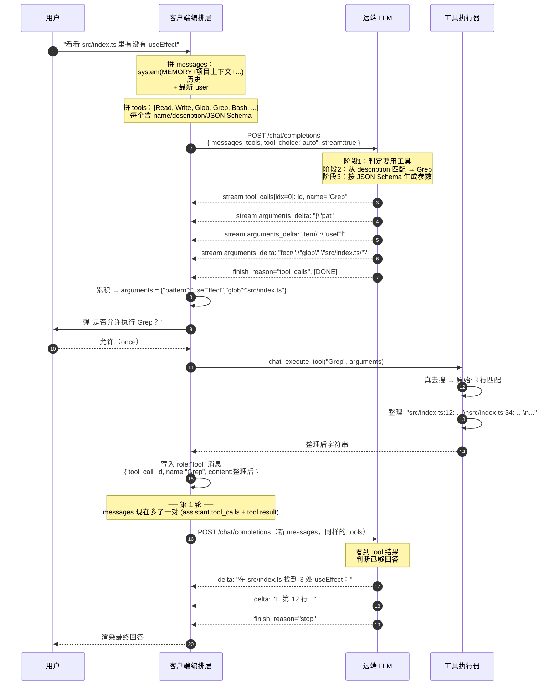

# Chat 工具调用 · 实现原理设计文档

> 本文回答四个问题：
> 1. 一条用户消息是怎么变成发往远端接口的请求的？
> 2. 我有 N 个工具，怎么把它们"合理"地暴露给大模型？
> 3. 大模型是凭什么从"帮我看看 README"这种自然语言里挑出 `Read` 工具、并且填对参数的？
> 4. 工具返回千奇百怪，如何整理成能让模型继续推理的形态？
>
> 与具体实现语言无关。

---

## 0. 心智模型：把 LLM 当成一个不会动手的程序员

在工具调用范式里，分工是这样的：

| 角色      | 能做                                     | 不能做                                     |
| --------- | ---------------------------------------- | ------------------------------------------ |
| **LLM**   | 理解用户意图 → 选工具 → 编参数 → 解读结果 | 实际读文件、跑命令、调网络                  |
| **客户端** | 真正执行工具，把结果以约定格式回喂给 LLM   | 决策"用哪个工具/传什么参数"                 |
| **用户**  | 提需求 + 在敏感操作上点"允许/拒绝"        | -                                          |

整套循环就是 **"LLM 出意图 → 客户端动手 → LLM 看结果再决定下一步"** 的反复迭代。所以"工具调用"本质上是 **结构化输出 + 函数路由**，并不是某种神秘的 RPC。

```
        user prompt
             │
             ▼
       ┌───────────┐
       │    LLM    │── tool_calls(name, JSON args) ──┐
       └─────▲─────┘                                  │
             │                                        ▼
             │                                ┌──────────────┐
             │                                │  客户端执行   │
             │                                │  (本地代码)   │
             │                                └──────┬───────┘
             │                                       │ result string
             │   tool message{ name, content }       │
             └───────────────────────────────────────┘
```

---

## 1. 把一条用户消息送出去发生了什么

### 1.1 整体形态

发往远端接口的 **永远是同一个端点**：`{baseUrl}/chat/completions`。
"工具/上下文/记忆/系统提示"全部塞在一个 JSON body 里。

```text
POST {baseUrl}/chat/completions
Authorization: Bearer {apiKey}
Content-Type: application/json

{
  "model": "gpt-4o-mini",
  "stream": true,
  "temperature": 0.7,
  "max_tokens": 2048,

  "messages": [ ...见 §1.2... ],

  "tools": [ ...见 §2... ],
  "tool_choice": "auto"
}
```

**核心观察**：远端接口是一个**无状态的纯函数**。它每次只看 body 里的 `messages + tools`，不知道你前几轮聊了什么、有什么文件、当前目录在哪——所有这些"上下文"都得由客户端自己在每次请求时塞进 body。

### 1.2 messages 数组的"层级感"

发出去的 `messages` 看起来扁平，但其实有 4 层语义优先级，从前到后摆放：

```text
┌──────────────────────────────────────────────────┐
│ [system]   ← 不可违反的"宪法"层                    │
│   • 全局 MEMORY.md（用户偏好）                     │
│   • 项目上下文（cwd / 文件树 / CLAUDE.md）          │
│   • 可用编辑器列表                                  │
│   • 会话级 systemPrompt                            │
│   • 本轮 @ 文件 / URL 抓取的预填内容                │
├──────────────────────────────────────────────────┤
│ [user/assistant/tool] ← 多轮历史                   │
│   • user 1                                         │
│   • assistant 1 (含 tool_calls?)                   │
│   • tool 1.a (id=call_xxx, name=Read)              │
│   • tool 1.b (id=call_yyy, name=Grep)              │
│   • assistant 2                                    │
│   • ...                                            │
├──────────────────────────────────────────────────┤
│ [user] (最新) ← 本轮真正的诉求                      │
└──────────────────────────────────────────────────┘
```

为什么这么排：

- **system 在最前**：影响 LLM 注意力分配的最强位置；同时模型对 system 的"权威感"明显高于普通消息。
- **历史按时间序**：让模型理解上下文演化；尤其是 `assistant.tool_calls → tool result` 这一对必须**严格成对相邻**，否则供应商会拒绝（`tool` 角色必须紧跟在它对应的 `assistant` 之后）。
- **最新 user 在最后**：模型对靠近末尾的指令敏感，"最新意图"放最后能避免被前面的 system / 历史压住。

---

## 2. 工具组怎么暴露给模型："tools 数组"的设计哲学

`tools` 是一个 OpenAI 协议格式的数组，**这就是大模型能看到的全部工具说明书**。模型既看不到工具实现代码，也看不到调用结果之外的运行时信息。

### 2.1 单个工具的 schema

```json
{
  "type": "function",
  "function": {
    "name": "Read",
    "description": "读取文件内容，返回带行号的文本。path 必须在会话 allowedCwd 下。",
    "parameters": {
      "type": "object",
      "properties": {
        "path":   { "type": "string", "description": "绝对路径或相对 allowedCwd" },
        "offset": { "type": "integer", "description": "起始行号（1 基）" },
        "limit":  { "type": "integer", "description": "读取行数，缺省 2000" }
      },
      "required": ["path"]
    }
  }
}
```

**3 个字段对模型的不同作用**：

| 字段          | 作用                                                                    | 给模型的"信号"                      |
| ------------- | ----------------------------------------------------------------------- | ----------------------------------- |
| `name`        | 工具的"标识符"，模型生成时要原样回填                                      | "我能调用什么"                      |
| `description` | 这是模型**判断"该不该用这个工具"** 的最关键依据                            | "什么时候用 / 不该用"               |
| `parameters`  | JSON Schema，约束模型生成参数的结构                                       | "怎么用 / 必填什么 / 各字段类型"     |

### 2.2 工具集（tools 数组）的"合理应用"

把 `tools` 数组想象成"放在大模型工具腰带上的工具盒"。设计原则：

1. **正交不重叠**。每个工具只解决一个明确问题，不要一个工具能干两件相似的事（否则模型会犹豫）。
   - 例：`Read`（按行读文件）/`Glob`（按 pattern 找文件）/`Grep`（按内容搜文件）三件套，能力不重叠。
2. **风险分级且在描述里说出来**。让模型从描述本身就能感知"这是只读 / 这是会改东西 / 这是危险操作"。
   - 例：`DeleteFile.description` 开头是 `"⚠️ 危险：删除文件或目录..."`，模型在生成调用前会比 `Read` 更慎重。
3. **能力下沉到工具，不要要求模型推理风险**。例如 `Edit` 工具强制 `oldString 在文件中唯一出现`——这条不变量写进工具实现里，模型生成错就立刻报错让它重试，而不是指望模型自己写代码逐行 diff。
4. **靠"软强制"切换工具子集**。第 0 轮如果用户说"用 NAME 工具"，前端就把 `tools` 裁剪成只剩 `NAME` 一个、并设 `tool_choice = { name: NAME }`，模型没得选；进入循环后 `tool_choice` 立刻回退到 `auto`，避免死循环。
5. **可关闭**。`toolsEnabled=false` 时根本不传 `tools`，请求退化为纯对话——这样"普通问答"和"agent 模式"用同一条代码路径，无需双轨。
6. **每会话子集**。`session.enabledTools` 可以让用户在一个项目会话里只暴露 `[Read, Grep, Glob]`，避免无意中跑 `Bash`。

### 2.3 工具命名与描述的"启发式"

下面是项目里实际用到的几条规律，提炼出来：

| 启发式                                                | 例子                                                                  |
| ----------------------------------------------------- | --------------------------------------------------------------------- |
| **Pascal/Camel 命名**，让模型一眼看出是"动作"          | `Read` / `WebFetch` / `OpenInEditor`                                  |
| **描述首句先说"做什么"，后面补"怎么用 / 限制"**        | `"读取文件内容，返回带行号的文本。path 必须在会话 allowedCwd 下。"` |
| **危险操作首字符放警告符**                           | `"⚠️ 危险：删除..."`                                                   |
| **参数名贴近自然语言**                                | `path / pattern / glob / command / url`，而不是 `arg1`                |
| **每个参数都给 description**，明确单位与默认值        | `"timeout: 超时毫秒，缺省 60000"`                                      |
| **必填项放 `required`**，避免模型偷懒不传              | `["path"]` / `["pattern"]` / `["url"]`                                 |
| **枚举用 `enum`**，逼模型选项内取值                    | `status: { type:"string", "enum":["pending","in_progress","completed"] }` |
| **复杂能力描述里点明协议格式**                       | `WebFetch.description` 里直接说"自动识别 HTML/JSON/纯文本并做对应处理" |

后面这一条尤其重要：**LLM 决策用不用一个工具，几乎完全靠 `description`**。`description` 写得好等于把你的代码注释直接送进了模型的"工作记忆"。

---

## 3. 大模型是怎么"听懂自然语言"挑工具的

很多人会觉得这一步神秘——其实就是模型在做 **"基于自然语言相似度的多选一 + 结构化生成"**。可以这样拆：

### 3.1 决策的 3 个阶段

```text
用户说："帮我看看 src/index.ts 里有没有 useEffect"
                │
                ▼
┌─────────────────────────────────────────────┐
│  阶段 1：要不要用工具                          │
│   - 看历史 + 当前问题，是"问事实/做事"吗？      │
│   - 当前 tools 数组里是否有匹配语义的？         │
│   - tool_choice 是 auto/none/required/{...}？  │
└─────────────────────────────────────────────┘
                │ 是
                ▼
┌─────────────────────────────────────────────┐
│  阶段 2：选哪个工具                            │
│   候选: [Read, Glob, Grep, Bash, ...]        │
│   语义匹配：                                   │
│     - "看看…里有没有 X" ≈ Grep.description     │
│       ("按正则搜索（逐行）, glob 可选限制文件")  │
│   决策: Grep                                  │
└─────────────────────────────────────────────┘
                │
                ▼
┌─────────────────────────────────────────────┐
│  阶段 3：构造参数（受 JSON Schema 约束）       │
│   { "pattern": "useEffect",                  │
│     "glob":    "src/index.ts" }              │
└─────────────────────────────────────────────┘
                │
                ▼
   作为 tool_calls 流式吐出，整段 arguments 是 JSON 字符串
```

### 3.2 为什么这套机制可靠

模型并不需要"理解"你的代码或文件系统，它只需要：

1. **理解描述里的关键词**（"读文件 / 搜内容 / glob 模式"），把它们和用户问题做语义匹配。
2. **遵守 JSON Schema**——这是模型在训练阶段被反复强化的"格式纪律"。`required` 字段缺了它会自己补默认；类型对不上会重新生成。
3. **在 tool_choice="auto" 下做"用 vs 不用"的二元判断**：如果当前问题完全可以用对话直接回答，模型会**故意不调工具**。这点很重要——它意味着你不需要担心"暴露太多工具会让模型乱用"。

### 3.3 参数生成的细节：为什么是字符串？

供应商的流式协议里，`tool_calls[i].function.arguments` 是 **字符串**，**不是 JSON 对象**：

```text
delta.tool_calls[0] = { index: 0, function: { arguments: "{\"path\":\"" } }
delta.tool_calls[0] = { index: 0, function: { arguments: "src/inde"        } }
delta.tool_calls[0] = { index: 0, function: { arguments: "x.ts\"}"          } }
```

这样设计是因为：

- 流式输出的天然单位是 token（≈ 字符），切到 JSON 对象边界很难。
- 字符串增量直接拼接就行，客户端只需在一个工具调用结束（`finish_reason="tool_calls"` 或下一个 index 出现）后再 `JSON.parse` 整段。
- 客户端可以容忍**生成到一半的 JSON**——半成品永远不会被解析、不会被执行。

这就是为什么前端 `toolCallsRef[index] = { id, name, arguments }`，`arguments` 用字符串拼接累积，而不是用对象逐字段 patch。

### 3.4 软强制（force）vs 自由决策（auto）

| `tool_choice` 值                              | 模型行为                                       | 何时用                                  |
| --------------------------------------------- | ---------------------------------------------- | --------------------------------------- |
| `"auto"`（默认）                              | 自己决定要不要用工具，用哪个                    | 大多数场景                              |
| `"none"`                                      | 不调用任何工具，只产生文本                     | 不传 `tools` 等价                        |
| `"required"`                                  | 必须调用一个工具，但用哪个由模型选              | "我希望它一定动手"                      |
| `{ type:"function", function:{ name:"X" } }`  | 必须调用 X，且只能调 X                         | 用户明确说"用 X 工具"                    |
| 不传 `tool_choice` 但传 `tools`              | 等价于 `auto`                                  | -                                       |

项目里只在第 0 轮做软强制（`detectForcedTool` 识别 `[使用 NAME 工具]` 前缀），后续轮次一律用 `auto` —— 因为强制的代价是"模型可能反复调同一个工具陷入死循环"。

---

## 4. 接口返回是怎么被"自动整理"的

工具执行完产生的原始输出形态各异：文件可能 5 万行、Bash 输出可能含 ANSI 控制符、HTTP 响应可能是 PDF 二进制。直接塞给模型会出三类问题：**超长爆 context / 噪声干扰推理 / 二进制无法解码**。所以客户端必须把"原始返回"做一层规整化，再以约定格式回填。

### 4.1 整理的目标

把 `(工具, 参数, 原始结果)` 三元组**翻译**成模型容易二次消费的字符串，目标是：

1. **保留信号**：原始数据里能让模型继续推理的部分一定要在。
2. **压制噪声**：行号、分隔符、状态码这种"脚手架信息"该加就加。
3. **强制有界**：不管原始多大，回填给模型的字符串永远 ≤ 某个上限。
4. **失败有形**：失败也是一种结果，要变成可读字符串而不是 throw。

### 4.2 项目里 5 种典型整理策略

#### 策略 A · 加行号（让模型能精准引用）

`Read` 工具：

```text
原始: "import x from 'a';\nimport y from 'b';\n"
整理: "     1\timport x from 'a';\n     2\timport y from 'b';\n"
```

为什么：模型后续如果要用 `Edit`，`oldString` 必须唯一定位；带上行号能让它在解释结果时直接说"第 12 行的 useEffect"，下游 Edit 工具也更容易写对。

支持 `offset / limit` 让模型自己分页：

```text
返回末尾自动加：
"… [已截断，共 200000 字节]"
```

#### 策略 B · 多通道合并 + exit code（让模型理解"程序成功/失败"）

`Bash` 工具：

```text
exit: 0
---stdout---
hello world
---stderr---
warning: deprecated flag
```

为什么这样写：

- `exit:` 单独一行第一行——模型一眼判断成败。
- `---stdout---` / `---stderr---` 用易识别分隔——避免模型把 stderr 当正确输出。
- 全部按字节截断到 50000，超出加 `… [已截断，共 N 字节]`。

#### 策略 C · 内容感知整理（按 Content-Type 分支）

`WebFetch` 工具是最典型例子：

```text
[WebFetch 200]
URL: https://api.github.com/repos/x/y
Content-Type: application/json
Size: 4231 bytes

{
  "name": "y",
  "stargazers_count": 1234,
  ...
}
```

按 `Content-Type` 分 4 路：

| Content-Type 包含                                             | 处理                                            |
| ------------------------------------------------------------- | ----------------------------------------------- |
| `image/`, `audio/`, `video/`, `application/octet-stream`, `application/pdf`, `application/zip`, ... | 不返回正文，只回 `（二进制内容，CT=…，大小=…，已跳过正文）` |
| `application/json` 或 `+json`                                  | `serde_json::to_string_pretty` 美化（失败回退原文）  |
| `text/html` / `application/xhtml` / 起手 `<` 的内容             | 走 `html_to_text` 剥标签（去 `<script>/<style>`，剩纯文本，折叠空行）   |
| 其他文本                                                       | 原样                                            |

抬头固定加 4 行元信息（`[WebFetch 200] / URL / Content-Type / Size`），这样模型不用从字面上猜响应，可以**按结构化字段做断言**：拿到 `404` 立刻知道要换 URL；拿到 `Size: 0` 知道目标空。

#### 策略 D · 结果可枚举化（让模型像看清单一样看输出）

`Glob`：

```text
src/foo.ts
src/bar.ts
src/baz/index.ts
… 共 1234 个匹配，只展示前 500
```

`Grep`：

```text
src/foo.ts:23: const handler = useEffect(() => {
src/bar.ts:18: useEffect(() => deps,[])
… 结果已截断至 200 行
```

整理的核心是 `path:line: text` 的固定三段式——和 `grep -n` 一样，模型在训练阶段见过无数次这种格式，认识得一塌糊涂。

#### 策略 E · 失败也是结果

工具实现里所有错误**都不向上抛**到客户端——而是 `Result::Err(String)` 返回错误字符串，前端把它包成：

```
执行失败: <error message>
```

写成 `role:"tool"` 消息回给模型，让模型自己决定：换参数重试 / 改用其他工具 / 给用户报错。

特别地，用户拒绝授权时也走这条路径：

```
（用户拒绝执行此工具）
```

模型看到这个会通常自动改口"那我换种方式"或者直接回答用户。**这种"软失败"比 hard fail 抛错更适合 agent 循环——agent 永远在前进，而不是中断。**

### 4.3 整理的不变量

不管哪个工具，回填字符串都满足下列不变量，让模型形成稳定预期：

1. **永远是字符串**（不是 JSON 对象/二进制）。
2. **有界**（每个工具自己定 truncate 上限：Read 200k / Bash 50k / WebFetch 由 `max_bytes` 决定）。
3. **截断时显式标记**`… [已截断，共 N 字节]` —— 不让模型误以为输出完整。
4. **错误以"执行失败: …"开头** —— 模型能可靠地分辨成功/失败分支。
5. **格式可被肉眼解析** —— 不依赖任何特殊 marker；用换行 / 制表符 / `key: value` 这种通用结构。

---

## 5. 完整一轮的接口对话

把上面 4 节串起来：



整套机制能跑通的关键是：

- 第 4 步 `tools` 描述写得好，模型能从"看看…里有没有"匹配到 `Grep`。
- 第 8-10 步 LLM 严格按 JSON Schema 生成 `pattern / glob`，客户端不用自己解析自然语言。
- 第 14 步整理后的格式 (`path:line: text`) 是模型见过最多的格式之一，不需要额外解释。
- 第 16 步把 `tool` 消息按协议位置（紧跟 assistant.tool_calls）回填，第二轮模型才能正确"看见"工具结果。

---

## 6. 实战：怎么写一个新工具

按这个顺序做，能让模型最大概率正确使用：

### 第 1 步 · 写 schema（**最重要的一步**）

```rust
ToolSchema {
    name: "MyTool".into(),
    description:
        "（一句话说做什么）。\
         （限制条件：参数边界 / 何时不该用 / 副作用）。".into(),
    parameters: json!({
        "type": "object",
        "properties": {
            "key1": { "type": "string", "description": "（说人话）" },
            "key2": { "type": "integer", "description": "（带单位与默认）" }
        },
        "required": ["key1"]
    }),
    requires_cwd: false,   // true 表示只能在 allowedCwd 沙箱内跑
}
```

**自检清单**：
- [ ] 这个工具和已有工具的功能不重叠
- [ ] description 第一句话能让没读过代码的人立刻知道用途
- [ ] 危险操作开头加了 `⚠️`
- [ ] 所有参数都有 description 而不是只有类型
- [ ] required 列出了真正必填项
- [ ] 默认值/单位写在了 description 里

### 第 2 步 · 实现工具函数

```rust
fn tool_my_tool(ctx: &ToolCtx, args: &Value) -> Result<String, String> {
    let key1 = args.get("key1").and_then(|v| v.as_str()).ok_or("缺少 key1")?;
    // 真正的业务逻辑
    let raw_result = do_something(key1)?;
    // ★ 整理：让结果可被模型继续推理
    Ok(format_for_llm(raw_result))
}
```

**自检**：
- [ ] 输入参数缺失/类型错时返回的 Err 字符串足够清楚（"缺少 key1" 比 "Invalid input" 好）
- [ ] 所有路径操作都过 `require_under_cwd` 校验
- [ ] 返回字符串走过 `truncate(s, MAX)` 保护
- [ ] 失败用 Err 不要 panic

### 第 3 步 · 注册到 dispatch

```rust
match tool_name {
    // ...
    "MyTool" => tool_my_tool(&ctx, &args),
}
```

加进 `all_tools()` 返回的数组里。

**就这三步**——没有任何前端代码要改：前端的 `listTools()` 自动取到新 schema、`ChatPage` 把它丢进 `tools` 数组发给 LLM、模型自然就开始考虑用它。

---

## 7. 边界与陷阱

| 陷阱                                                          | 后果                                                                | 规避                                                |
| ------------------------------------------------------------- | ------------------------------------------------------------------- | --------------------------------------------------- |
| `description` 写成 "do something with the file"               | 模型不知道何时该用这个工具，要么不用，要么乱用                       | 写清楚 What / When / Limit                          |
| 同一能力 2 个工具（如 `ReadFile` 和 `Read`）                  | 模型反复在两个之间切换                                              | 合并；或 description 里明确各自适用场景             |
| 工具返回大 JSON 不美化                                        | 模型在一行里读 5000 字符容易丢 key                                  | 美化或挑关键字段                                    |
| 工具失败 throw 抛到客户端                                     | 工具循环中断；模型不知道发生了什么                                  | 转成 Err 字符串以 `role:"tool"` 回填                |
| 工具返回里混了 ANSI 控制符 / 终端转义                         | 模型把转义字符当文本，回答时也带                                    | 提前 strip                                          |
| `tool_call_id` 在历史里和 assistant 不一致                     | 供应商 400                                                          | 严格按"assistant.tool_calls[i].id == tool.tool_call_id"  |
| 上一轮 tool 消息写完没立刻保存就发下一轮                        | 远端拒绝（缺对应 tool 结果）                                        | 每个 tool 写完立刻 save_chat_session                |
| 工具循环无上限                                                | 模型自循环烧 token                                                  | `MAX_TOOL_ROUNDS` + 提前警告                        |
| `tool_choice = required` + 工具列表不匹配意图                 | 模型硬调一个最不合适的工具                                          | 默认 `auto`；只有用户明确"用 X"才强制 `name=X`       |
| 工具描述里写 "internal" / "do not use"                        | 这条文本模型也会读到，反而引发好奇心                                | 别在 schema 里留实现细节                            |

---

## 8. 一图速记

```text
┌───────────────────────────────────────────────────────────────────────┐
│                      一次工具对话的全貌                                  │
├───────────────────────────────────────────────────────────────────────┤
│                                                                       │
│  用户自然语言                                                          │
│       │                                                                │
│       ▼                                                                │
│  ┌────────────────────────────────────────────────────────────┐       │
│  │  客户端 拼请求                                              │       │
│  │  body.messages = [system(注入), 历史(含tool_calls/tool), user] │
│  │  body.tools    = [{name, description, parameters: JSONSchema}*]│
│  │  body.tool_choice = "auto" | { name }                       │       │
│  └────────────────────────────────────────────────────────────┘       │
│       │ POST /chat/completions, stream=true                            │
│       ▼                                                                │
│  ┌────────────────────────────────────────────────────────────┐       │
│  │   LLM                                                       │       │
│  │   ① 看 tools.description 与用户语义匹配                      │       │
│  │   ② 选定 name                                               │       │
│  │   ③ 按 JSON Schema 生成 arguments（流式字符串）              │       │
│  └────────────────────────────────────────────────────────────┘       │
│       │ delta.tool_calls[*]                                            │
│       ▼                                                                │
│  ┌────────────────────────────────────────────────────────────┐       │
│  │  客户端 累积 tool_calls 并按需弹出授权                       │       │
│  │  → chat_execute_tool(name, JSON.parse(arguments))           │       │
│  │  → 工具实现：跑业务逻辑                                      │       │
│  │  → 整理(原始结果)：加行号 / 加 exit / 按 CT 分支 / truncate   │       │
│  │  → 返回字符串                                                │       │
│  └────────────────────────────────────────────────────────────┘       │
│       │                                                                │
│       ▼                                                                │
│  追加 role:"tool" 消息（带 tool_call_id+name），保存                    │
│       │                                                                │
│       ▼                                                                │
│  下一轮 POST /chat/completions（messages 已含工具结果）                 │
│       │                                                                │
│       ▼                                                                │
│   要么继续 tool_calls，要么生成最终文本                                 │
│                                                                       │
└───────────────────────────────────────────────────────────────────────┘
```

**一句话总结**：

> **工具调用 = 用 description 教模型"何时该出手"，用 JSON Schema 把模型生成的自然语言压成结构化参数，再用约定格式把执行结果翻译回模型能继续推理的语言。三步都做对，模型就能在你的 N 个接口里来回穿梭，看起来像有意识地选工具——其实是你的 schema 写得好。**

---

## 附录 · 项目里的工具一览（按用途分组）

| 用途       | 工具                                            | requires_cwd |
| ---------- | ----------------------------------------------- | ------------ |
| 文件读     | `Read` `Glob` `Grep`                            | ✅           |
| 文件写     | `Write` `Edit`                                  | ✅           |
| 命令执行   | `Bash`                                          | ✅           |
| 网络       | `WebFetch` `OpenUrl`                            | ❌           |
| 系统操作   | `OpenPath` `OpenInEditor` `OpenTerminal`        | ❌           |
| 文件管理   | `CopyFile` `MoveFile` `DeleteFile (⚠️)`         | ❌           |
| 任务管理   | `TaskCreate` `TaskUpdate` `TaskList`            | ❌           |
| 工作流     | `CreateWorkflow` `RunWorkflowNow` `ListWorkflows` | ❌           |

`requires_cwd=true` 的工具会强制做 `canonicalize(target).starts_with(canonicalize(cwd))` 路径越界检查；`false` 的工具靠"危险参数白名单/受保护路径黑名单"做防护（如 `DeleteFile` 拒绝删 `/`、`/etc`、`C:\Windows` 等）。

---

## 关键代码索引

| 关注点                                | 文件                                                           |
| ------------------------------------- | -------------------------------------------------------------- |
| 所有工具 schema 定义（`all_tools()`） | `src-tauri/src/commands/tools.rs` (≈ L133-388)                 |
| 工具执行入口与 dispatch               | `src-tauri/src/commands/tools.rs` (`execute_tool`, ≈ L1092)    |
| 路径沙箱校验                           | `src-tauri/src/commands/tools.rs` (`require_under_cwd`)        |
| WebFetch 内容感知整理                  | `src-tauri/src/commands/tools.rs` (`run_web_fetch` + `html_to_text`) |
| Bash 整理（exit + stdout/stderr）     | `src-tauri/src/commands/tools.rs` (`tool_bash`)                |
| Read 行号渲染                          | `src-tauri/src/commands/tools.rs` (`tool_read`)                |
| 客户端工具循环编排                    | `src/pages/Chat/index.tsx` (`runChatRequest`, `executeAndContinue`) |
| 客户端 tool_calls 累积                 | `src/pages/Chat/hooks/useChatStream.ts` (`toolCallsRef`)       |
| 软强制工具识别                         | `src/pages/Chat/index.tsx` (`detectForcedTool`)                |
